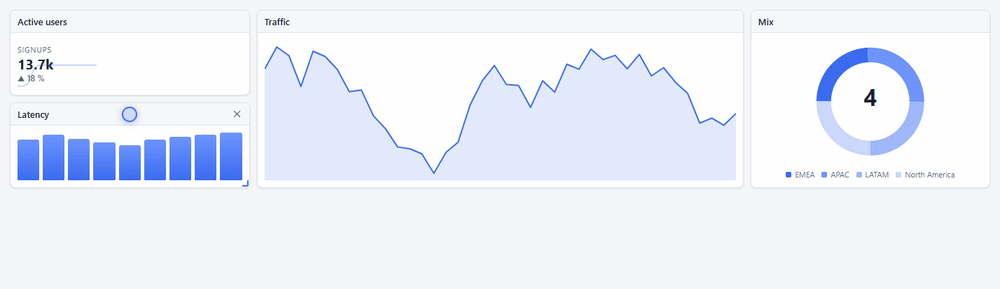
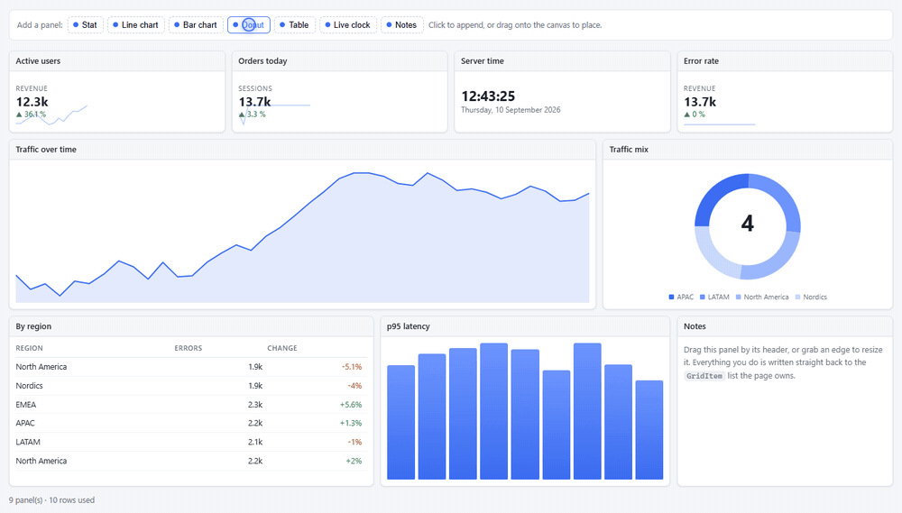
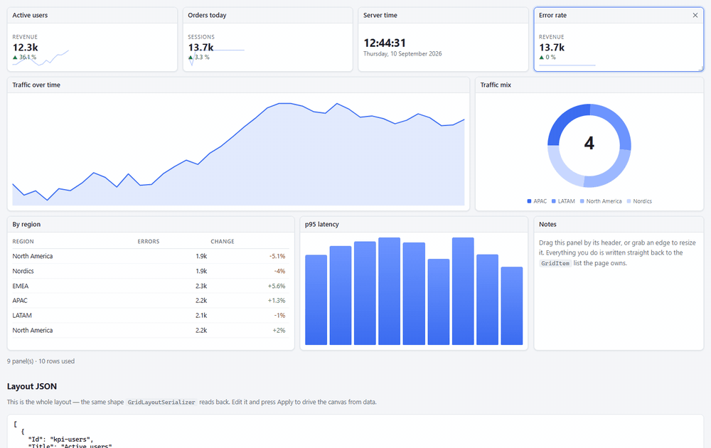
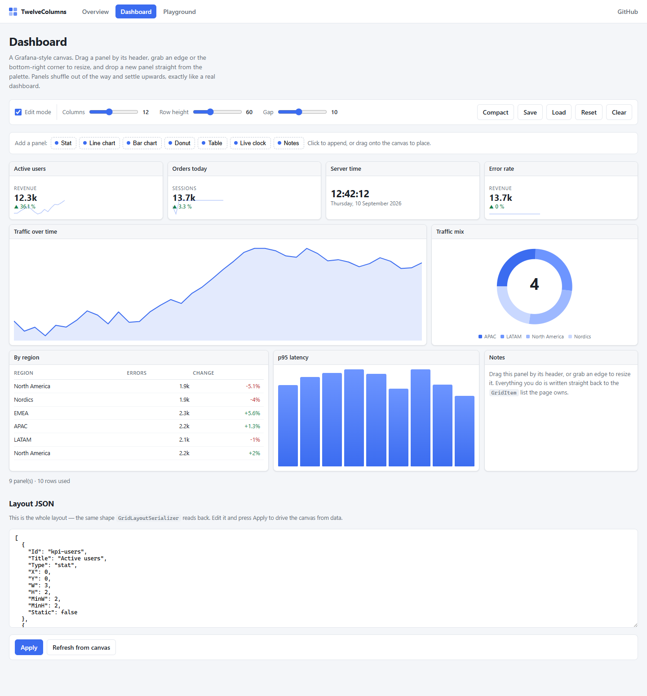
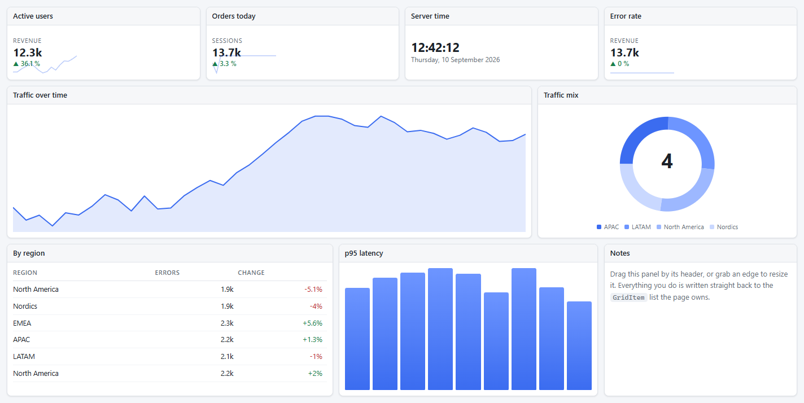
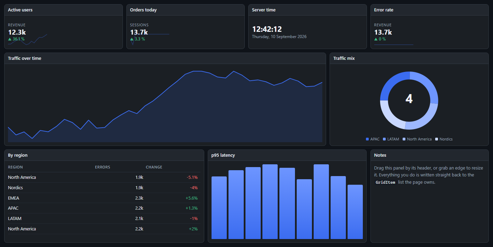
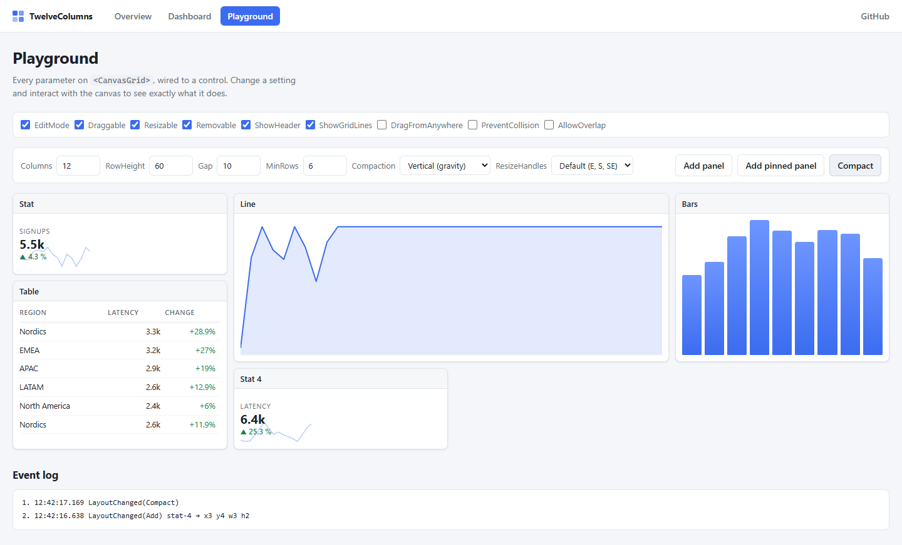

<div align="center">

# 12Columns

**A Grafana-style drag-and-drop dashboard canvas for Blazor.**

[](https://dotnet.microsoft.com/)
[](https://learn.microsoft.com/aspnet/core/blazor/)
[](tests/TwelveColumns.Tests)
[](LICENSE)

</div>

`<CanvasGrid>` gives any Blazor app a 12-column widget canvas. The end user rearranges it
with the mouse, pen or touch; the developer drives it from plain C#. Widgets shuffle out of
each other's way and settle upwards, the way a real dashboard behaves.


## Quick start

```razor
<CanvasGrid Items="_items" Columns="12">
    <ItemTemplate>
        <MyPanel Item="context" />
    </ItemTemplate>
</CanvasGrid>

@code {
    List<GridItem> _items = [
        new() { Title = "Traffic", X = 0, Y = 0, W = 8, H = 4 },
        new() { Title = "Mix",     X = 8, Y = 0, W = 4, H = 4 },
    ];
}
```

That is the whole integration. The canvas has no opinion about what a widget contains — it
owns geometry, and hands each `GridItem` back to your template.

## What the end user gets

### Drag to rearrange

Grab a panel by its header — or set `DragFromAnywhere` to drag from the whole surface.
Neighbours move out of the way while you drag, a placeholder shows where it will land, and
everything settles upwards when you let go. Mouse, pen and touch all work.



### Resize from an edge or a corner

The east, south and south-east grips are on by default; `ResizeHandles` opens up all eight.
Panels respect the `MinW`/`MinH` floor and `MaxW`/`MaxH` ceiling you set on each widget.


### Drop new widgets in from a palette

Set `AcceptExternalDrops` and handle `OnExternalDrop` to accept HTML5 drags from anywhere
on the page. The canvas tells you which cell the drop landed on; you decide what to insert.



### Move it without a mouse

Focus a panel and the arrow keys move it, `Shift`+arrows resize it, and `Delete` removes it —
the same layout engine, the same shuffling, no pointer required.



## Setup

> [!NOTE]
> The NuGet package is not published yet. Until it is, reference the project directly.

1. Reference the library.

   ```
   dotnet add reference path/to/src/TwelveColumns/TwelveColumns.csproj
   ```

   Once published, this becomes `dotnet add package TwelveColumns`.

2. Link the stylesheet in `App.razor` (or `index.html`).

   ```html
   <link rel="stylesheet" href="_content/TwelveColumns/twelvecolumns.css" />
   ```

3. Import the namespace in `_Imports.razor`.

   ```razor
   @using TwelveColumns
   ```

The JavaScript module loads itself on demand — there is no script tag to add and no
`builder.Services` registration.

Works on Blazor Server, WebAssembly and the .NET 10 Blazor Web App with any interactive
render mode. The canvas needs interactivity: on a Web App, give the page or component
`@rendermode InteractiveServer` (or `InteractiveWebAssembly`/`InteractiveAuto`).

## The widget model

```csharp
public class GridItem
{
    public string Id { get; set; }        // stable identity; used as the render key
    public string? Title { get; set; }    // shown in the built-in header
    public string? Type { get; set; }     // your discriminator, e.g. "chart" / "table"

    public int X, Y, W, H;                // position and size, in grid units
    public int MinW, MinH;                // resize floor
    public int? MaxW, MaxH;               // resize ceiling

    public bool Draggable, Resizable, Removable;
    public bool Static;                   // pinned: never moves, others route around it
    public string? CssClass { get; set; } // extra class on this widget's element

    public object? Data { get; set; }     // your payload; never serialized by the grid
    public Dictionary<string, string> Settings { get; set; }  // persisted with the layout
}
```

`X`/`W` are columns and `Y`/`H` are rows, so a widget spanning half of a 12-column canvas is
`W = 6` regardless of pixel width. Row height is fixed by the `RowHeight` parameter.

## Parameters

| Parameter | Default | Purpose |
| --- | --- | --- |
| `Items` | — | The widget list. Supports `@bind-Items`. Mutated in place. |
| `Columns` | `12` | Column count. Narrowing it re-flows widgets that no longer fit. |
| `RowHeight` | `60` | Row height in pixels. |
| `Gap` | `10` | Space between cells, in pixels. |
| `MinRows` | `4` | Rows the canvas reserves even when empty. |
| `EditMode` | `true` | Master switch. `false` makes the canvas read-only. |
| `Draggable` / `Resizable` / `Removable` | `true` | Global gates, ANDed with the per-widget flags. |
| `ResizeHandles` | `Default` | `Default` (E, S, SE), `Corners`, `Edges`, `All`, or any flag combination. |
| `DragFromAnywhere` | `false` | Drag from the whole widget instead of just its header. |
| `ShowHeader` | `true` | Render the built-in title bar and remove button. |
| `ShowGridLines` | `true` | Show column and row guides during a gesture. |
| `Compaction` | `Vertical` | `Vertical` for gravity, `None` for a free-form canvas. |
| `PreventCollision` | `false` | Refuse a move that would overlap instead of shuffling. |
| `AllowOverlap` | `false` | Let widgets stack. Disables all collision handling. |
| `AcceptExternalDrops` | `false` | Accept HTML5 drags from outside the canvas. |
| `SelectedId` | `null` | Selected widget. Supports `@bind-SelectedId`. |
| `Class` / `Style` | — | Appended to the canvas element. |

### Templates

| Template | Renders |
| --- | --- |
| `ItemTemplate` | The body of each widget. `context` is the `GridItem`. |
| `HeaderTemplate` | Replaces the title area of the built-in header. |
| `ItemActionsTemplate` | Extra header buttons, left of the remove button. |
| `EmptyTemplate` | Shown when the canvas has no widgets. |

### Events

| Event | Fires |
| --- | --- |
| `ItemsChanged` | Whenever the grid rewrites the list. |
| `OnLayoutChanged` | After any position or size change, with a `GridChangeReason`. |
| `OnInteractionStart` / `OnInteractionEnd` | At the ends of a drag or resize gesture. |
| `OnItemAdded` / `OnItemRemoved` | When a widget joins or leaves the canvas. |
| `OnExternalDrop` | When something is dropped in from outside. Set `args.Item` to insert it. |

## Driving the canvas from code

Capture the component with `@ref` and call it directly.

```razor
<CanvasGrid @ref="_grid" Items="_items">…</CanvasGrid>

@code {
    CanvasGrid? _grid;

    async Task AddChart()
    {
        // autoPlace finds the first free slot that fits.
        await _grid!.AddItemAsync(new GridItem { Title = "New chart", W = 4, H = 3 });
    }
}
```

| Method | Does |
| --- | --- |
| `AddItemAsync(item, autoPlace)` | Adds a widget, optionally into the first gap that fits. |
| `RemoveItemAsync(id)` / `RemoveItemAsync(item)` | Removes a widget. |
| `MoveItemAsync(id, x, y)` | Moves a widget, shuffling neighbours as a drag would. |
| `ResizeItemAsync(id, w, h)` | Resizes a widget within its min/max limits. |
| `CompactAsync()` | Re-applies gravity to the whole canvas. |
| `ClearAsync()` | Removes every widget. |
| `FindFreeSpot(w, h)` | The topmost, leftmost gap that fits. |
| `ExportJson()` / `ImportJsonAsync(json)` | Round-trips the layout. |
| `GetItem(id)`, `Layout`, `CurrentInteraction` | Read the current state. |

## Persisting a layout

`GridLayoutSerializer` writes geometry and `Settings`, and deliberately skips `Data` —
that belongs to your app.

```csharp
var json = grid.ExportJson();            // save to your database
await grid.ImportJsonAsync(json);        // restore later
```

Because `Type` and `Settings` survive the round trip, an `ItemTemplate` that switches on
`item.Type` can rebuild the whole dashboard from that JSON alone.



## Theming

Every colour, radius and shadow is a CSS custom property on `.tc-grid`, so you restyle the
canvas without overriding a single rule.

```css
.tc-grid {
    --tc-surface: #fff;
    --tc-surface-header: #f6f7f9;
    --tc-border: #dfe3e8;
    --tc-text: #1c2128;
    --tc-accent: #3b6cf0;
    --tc-radius: 8px;
}
```

A dark palette ships with the component and switches on automatically under
`[data-theme="dark"]` or `[data-bs-theme="dark"]`, or by adding `.tc-dark` to the canvas.

| Light | Dark |
| --- | --- |
|  |  |

## How it works

Cell geometry is pure CSS: the component writes `--tc-x`/`--tc-y`/`--tc-w`/`--tc-h` per
widget and column width is derived from the container, so widgets land in the right place
before any script runs.

The JavaScript layer only translates pointer movement into grid coordinates. It calls back
into .NET when the **target cell** changes rather than on every pixel, so a Blazor Server
circuit sees a handful of messages per gesture instead of hundreds. Between those callbacks
the widget is moved locally, which is what makes the drag feel immediate on a server-rendered
page.

The server stays the single source of truth for layout.
[`GridLayoutEngine`](src/TwelveColumns/Layout/GridLayoutEngine.cs) is pure C# with no Blazor
dependency — collision detection, push-away resolution and gravity compaction — which is why
it can be covered by ordinary unit tests, including fuzz runs that assert widgets never
overlap and never escape the grid.

## What's in the repository

| Project | What it is |
| --- | --- |
| [src/TwelveColumns](src/TwelveColumns) | The Razor Class Library. This is the shippable component. |
| [samples/TwelveColumns.Demo](samples/TwelveColumns.Demo) | A Blazor Server app that exercises the component. |
| [tests/TwelveColumns.Tests](tests/TwelveColumns.Tests) | xUnit tests for the layout engine and serializer. |

```
dotnet run --project samples/TwelveColumns.Demo    # http://localhost:5187
dotnet test
```

The demo has three pages: **Overview** (a minimal canvas plus the integration snippet),
**Dashboard** (a full nine-panel dashboard with a widget palette, JSON round trip and
save/load), and **Playground** (every parameter wired to a control, with a live event log).



## Licence

MIT. See [LICENSE](LICENSE).
